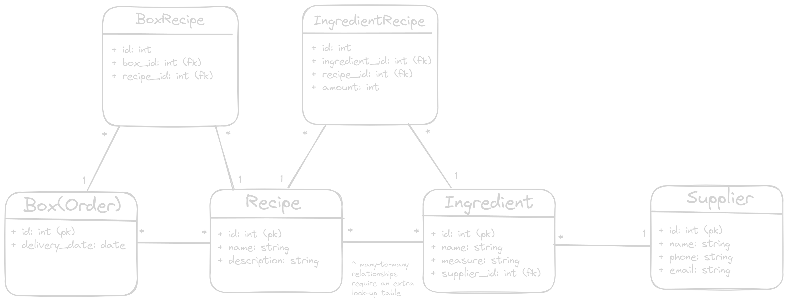
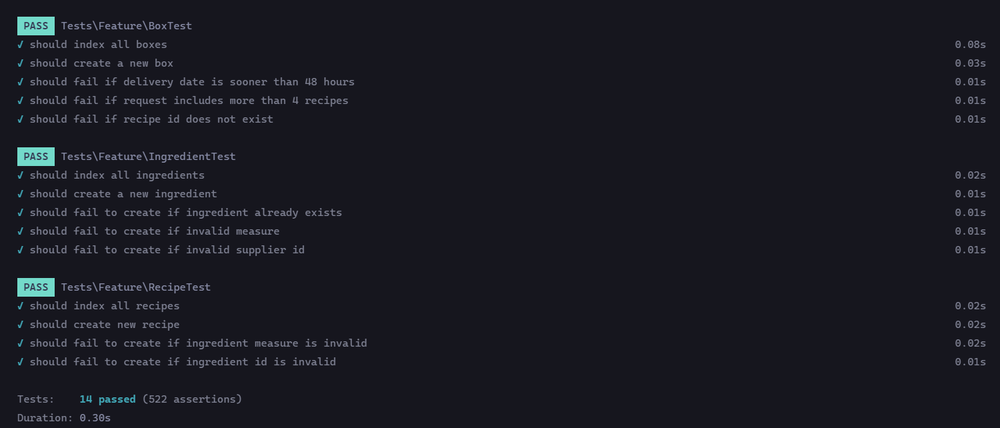
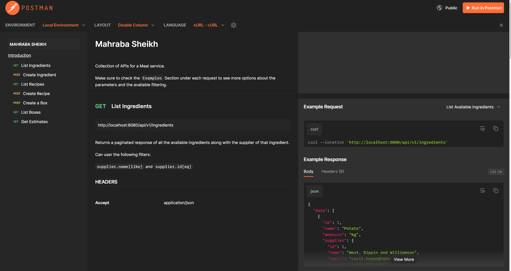

# marhabasheikh-recipie-box
A Set of RESTful APIs for a meal service allowing system owners to manage ingredients, recipes, and create customer orders with their customers required recipes. The system also allows helps in managing the ingredients sourcing and logistics.

# Database Design

## Entities
- Ingredient
- Supplier
- Recipe
- Box (Order)

## Assumptions
- __Each `Ingredient` can have only one `Supplier`__: In real life, an `Ingredient` can have many suppliers with different qualities and quantities. But for the sake of this project I choose to assume only one `Supplier` per `Ingredient`.

- an `Ingredient` cannot have duplicates in the database. As multiple __ingredients__ with the same name but maybe with different measures or suppliers, still causes confusion on which Ingredient to actually use.

- __`amount` can be `decimal` only for `kg` and `g`__: The `amount` field can be decimal in cases of `g` and `kg`, but not for `pieces`. So for example  it can have `0.1g` or `2.5kg` but not `1.5pieces`. Maybe in real life `pieces` are ceiled to the nearest integer for the order. For this project I assume `pieces` would only have whole values without fractions.

## DB Diragram


### IngredientRecipe Table
The table creates a mapping between the `Recipe` and the `Ingredients` used inside it. It is suitable to have the relationship like that so that whenever an `Ingredient` is removed from the `Ingredients` table we do not need to go to every `Recipe` and update it to  make sure that the `Ingredient` is not there anymore. A suitable solution is to have an __On Delete Cascade__ instruction so that when an `Ingredient` is removed from the system, it is removed from all the recipes.

Having an `amount` field on this table augments that symantics of the relationship as we can understand how many of this `Ingredient` is required for this exact `Recipe`, and each `Recipe` can have different `amounts` for this `Ingredient`.

`measure` field on the `Ingredient` is what defines the unit of the amount. So if the amount is `250` and the `measure` for this `Ingredient` is `g` then the required amount is `250g`.

### BoxRecipe Table
Same goes for this table. If a `Recipe` is removed from the system, it should be removed from all the `Boxes`
# Project Components
- Laravel ( v10.34.2 )
- MySQL DB ( v5.7 )
- phpMyAdmin ( v5.2 )

## Port Matrix

|Server|Port|Hostname|
|-|-|-|
|Laravel API|8080|[localhost](http://localhost:8080/api/v1/ingredients)|
|MySQL DB|3306|localhost|
|phpMyAdmin Server|8000|[localhost](http://localhost:8000/)|

# Run The Tests
```bash
$ php artisan test
```


# Running The Project
## Prerequisites
- [Docker](https://docs.docker.com/engine/install/)
- [Docker Compose (Standalone version)](https://docs.docker.com/compose/install/standalone/)
## Preflight Checks
### Docker
Before running the project make sure you have __Docker__ installed, and your __Docker Daemon__ is active and accepting connections.

To verfiy your docker installation, please run the following command
> Run the commands without the "$", its just to indicate user input
```bash
$ docker version

Client: Docker Engine - Community
 Cloud integration: v1.0.35+desktop.4
 Version:           24.0.6
 API version:       1.43
 Go version:        go1.20.7
 Git commit:        ed223bc
 Built:             Mon Sep  4 12:32:16 2023
 OS/Arch:           linux/amd64
 Context:           default

Server: Docker Desktop
 Engine:
  Version:          24.0.6
  API version:      1.43 (minimum version 1.12)
  Go version:       go1.20.7
  Git commit:       1a79695
  Built:            Mon Sep  4 12:32:16 2023
  OS/Arch:          linux/amd64
  Experimental:     false
```
### Docker Compose
Validate the `docker-compose` command is working on your machine
```bash
$ docker-compose --version

Docker Compose version v2.21.0-desktop.1
```

## Run The Project
Make sure that the `start.sh` and `stop.sh` are executable.

Run the following command:

```bash
$ sudo chmod +x start.sh stop.sh
```

Now run the followimg command to build and deploy the project:

```bash
$ ./start.sh
```

# Docs
## Endpoints
> All the endpoints are prefixed with `/api/v1`

|Name|Description|Method|Path|Filters|
|-|-|-|-|-|
|List Ingredients|Returns a paginated List of all the available ingredients along with the supplier of each ingredient|GET|`/ingredients`|`supplier.name[like]`, `supplier.id[eq]`|
|Create Ingredient|Create a new ingredient|POST|`/ingredients`|N/A|
|List Recipes|Returns a paginated list of all the available recipes along with the required ingredients and their amounts|GET|`/recipes`|N/A|
|Create Recipe|Create a new Recipe|POST|`/recipes`|N/A|
|List Boxes|Returns a pagined list of all the available Boxes(orders) in the system|GET|`/boxes`|`delivery_date[eq]`, `delivery_date[gt]`, `delivery_date[lt]`, `delivery_date[lte]`, `delivery_date[gte]`|
|Create Box|Creates an new Box(order)|POST|`/boxes`|N/A|
|Estimates|Returns a list of ingredients with the `total_amount` required to cover a period up to __7 Days__ from the `order_date`|GET|`/estimates`|N/A|

## Postman Docs
After deployment, you can test these request by visiting [this URL](https://documenter.getpostman.com/view/18390386/2s9YeLXUCn) to access the postman collection.
> REMINDER: DO NOT FORGET TO CHECK THE EXAMPLES DROP DOWN LIST FOR ALL THE OPTIONS



You can also import the Postman collection to your own Postman client, click on `Run in Postman` option, or import the collection
`postman-collection.json` file in the repo, go to __Postman__ and click `import` on the top left corner, and choose the `postman-collection.json` file. 