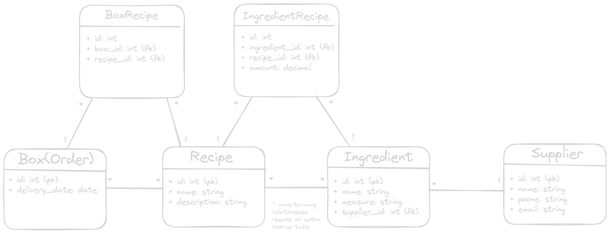

# marhabasheikh-recipie-box
A Set of RESTful APIs for a meal service allowing system owners to manage ingredients, recipes, and create customer orders with their customers required recipes. The system also allows helps in managing the ingredients sourcing and logistics.

# Database Design

## Entities
- Ingredient
- Supplier
- Recipe
- Box (Order)

## Assumptions
- __Each `Ingredient` can have only one `Supplier`__: In real life, an `Ingredient` can have many suppliers with different qualities and quantities. But for the sake of this project I choose to assume only one `Supplier` per `Ingredient`.

- __`amount` can be `decimal` only for `kg` and `g`__: The `amount` field can be decimal in cases of `g` and `kg`, but not for `pieces`. So for example  it can have `0.1g` or `2.5kg` but not `1.5pieces`. Maybe in real life `pieces` are ceiled to the nearest integer for the order. For this project I assume `pieces` would only have whole values without fractions.

## DB Diragram

### IngredientRecipe Table
The table creates a mapping between the `Recipe` and the `Ingredients` used inside it. It is suitable to have the relationship like that so that whenever an `Ingredient` is removed from the `Ingredients` table we do not need to go to every `Recipe` and update it to  make sure that the `Ingredient` is not there anymore. A suitable solution is to have an __On Delete Cascade__ instruction so that when an `Ingredient` is removed from the system, it is removed from all the recipes.

Having an `amount` field on this table augments that symantics of the relationship as we can understand how many of this `Ingredient` is required for this exact `Recipe`, and each `Recipe` can have different `amounts` for this `Ingredient`.

`measure` field on the `Ingredient` is what defines the unit of the amount. So if the amount is `250` and the `measure` for this `Ingredient` is `g` then the required amount is `250g`.

### BoxRecipe Table
Same goes for this table. If a `Recipe` is removed from the system, it should be removed from all the `Boxes`